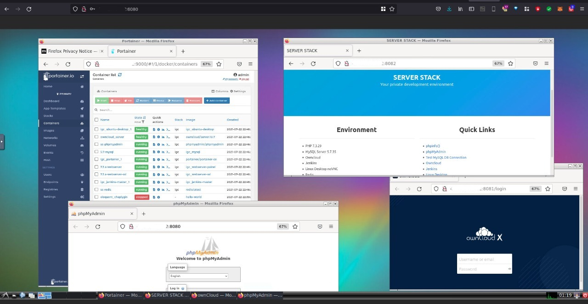

## Vessel Web OS

Vessel is a portable web operating system distribution. By deploying the vessel machine you have pre-configured servers such as Portainer, Owncloud, Jenkins, Redis, LAMP, Ubuntu XFCE with noVNC, MySQL and more!

We have developed Vessel as a quick, easy to use standalone machine with embedded servers and desktop functionalities. Vessel is the ideal lab tool for developers and system operators that need to have a consolidated and cost effective environment.

You can deploy your own machine by creating a fork in our GitHub repository https://bitbucket.org/systemcall_info/vessel/ or use one of the official server template builds. We are also developing support for several formats such as self hosted (Physical, XEN, KVM, VirtualBox, VMWare) and shared public cloud providers (AWS, Azure and Google). If you want to help send us a message!

## Cloud Server Templates

| AWS AMI Name | Machine Image Identification | 
|---| --- |
| v0.01 | ami-03a6f0fe8fa403aa2 |

Need hosting? You can request a free 3 day trial at contato@systemcall.info or by creating a request ticket with our forms https://forms.gle/SbmpLLRXNn6Nc4N89

## References
- https://en.wikipedia.org/wiki/EyeOS
- https://en.wikipedia.org/wiki/Web_desktop
- https://www.moneytimes.com.br/o-que-e-dfinity-e-seu-internet-computer-que-pode-substituir-a-internet-tradicional/
- https://windows96.net/

